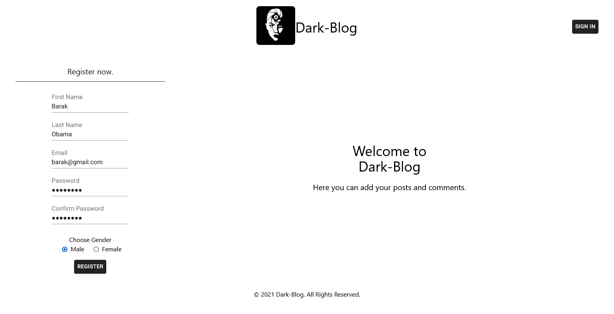
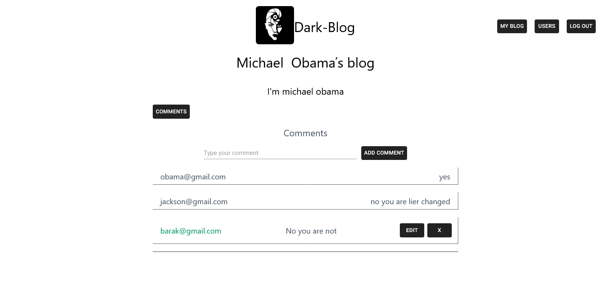

  
  
  
  
 # Welcome to Dark-Blog project

I present to you a small blog concept that works with the help of local storage  
---
  * Registration validation with Formik and Yup
  * All your incoming data is stored in local storage (you can't lose your data even if reloading the page)
  * Add posts and answer comments
  * Edit personal comments and posts
  
 ---
  
Main page
  
  
 ---

 Add comments
  
  

  ### Register with many users and imagine post comments.
